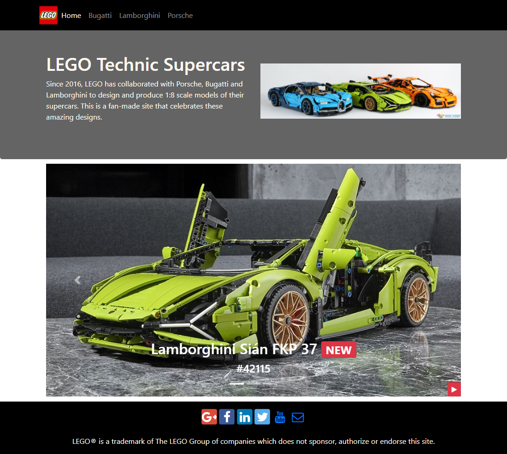
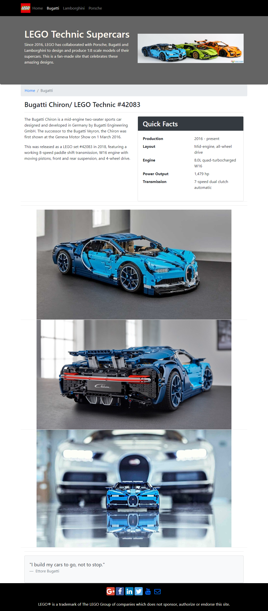
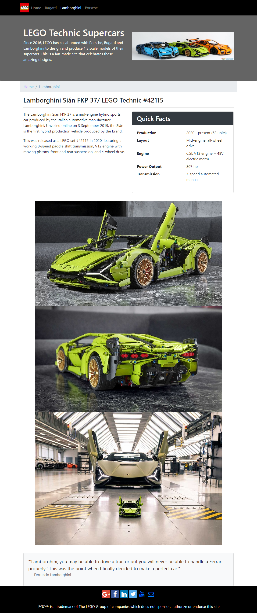
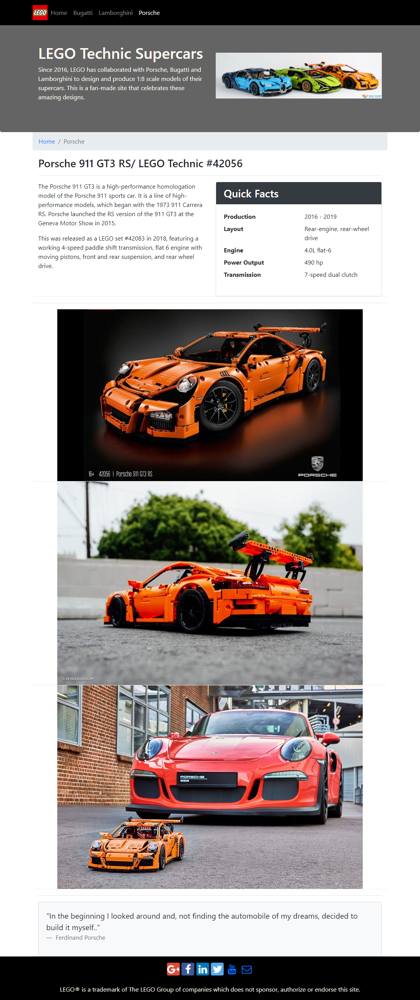
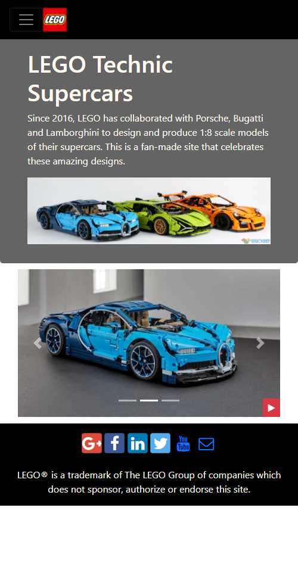
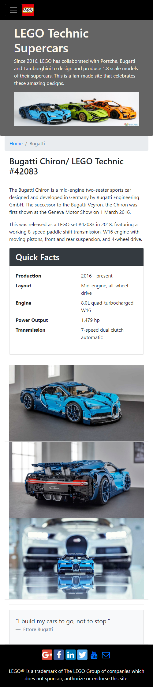
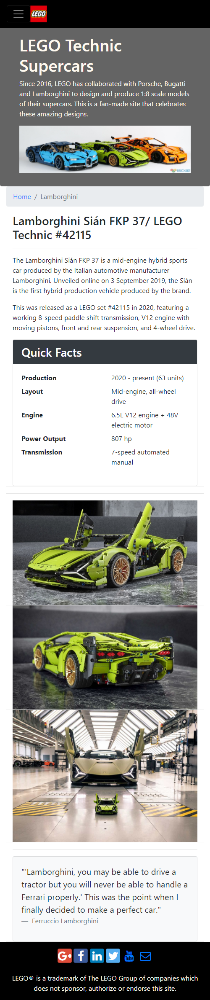
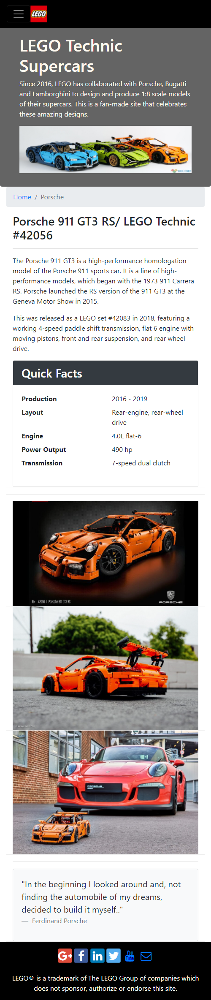

# LEGO Technic Supercars

## Background

I started learning front end web development on [Coursera](https://www.coursera.org/specializations/web-design), and needed to build a website for the Capstone project. In parallel, I had learnt Bootstrap 4 from another [course](https://www.coursera.org/learn/bootstrap-4), and was aiming to learn React to use for my eventual portfolio website. Thus, I didn't want to spend too much effort on this Capstone project, and planned to use Bootstrap 4 to create a simple but nice looking site. I like LEGO and think their recent collaborations with Lamborghini, Bugatti and Porsche to produce 1:8 scale supercars worked out really well, and decided to use this as the theme for my site.

## Web Design

Some of web design features I incorporated:
- Responsive design: the screenshots below show different views for mobile and desktop
- Html files were [validated](https://validator.w3.org/) and error free
- Carousel on home page with play/pause buttons
- Bootstrap card showing "quick facts"

## Desktop View

## Mobile View

