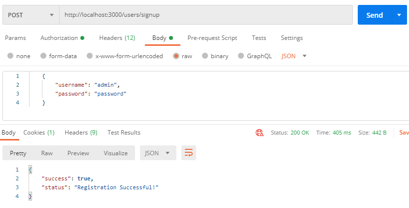
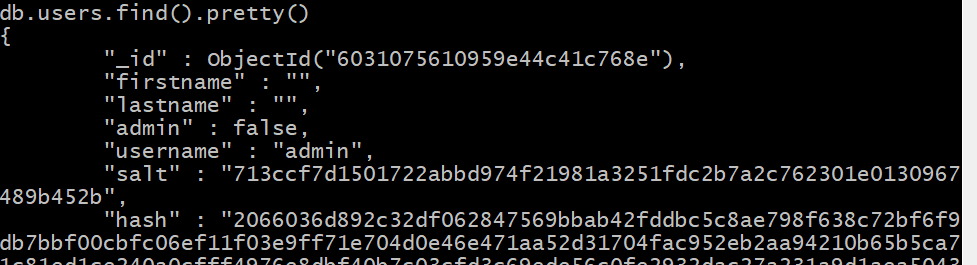
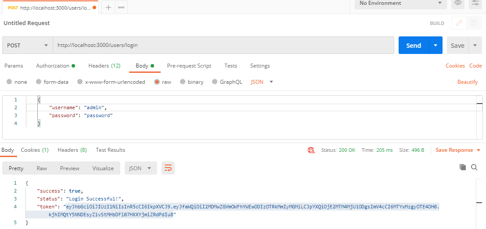
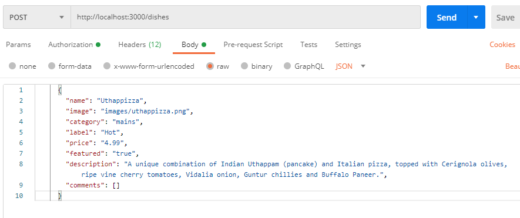
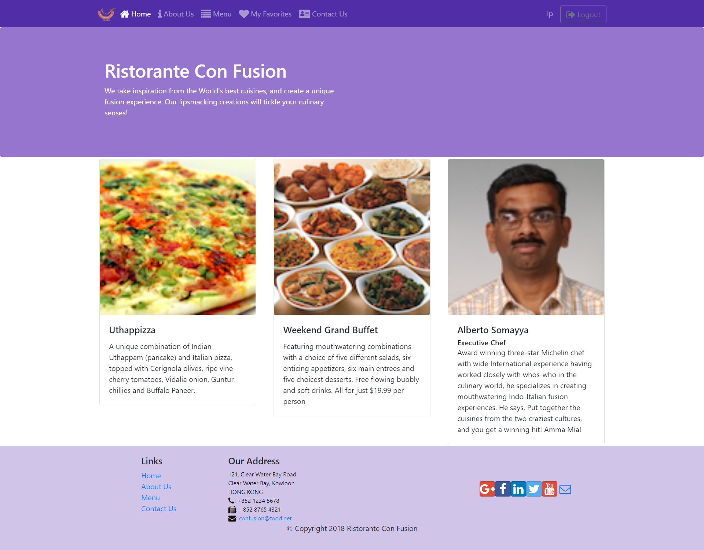
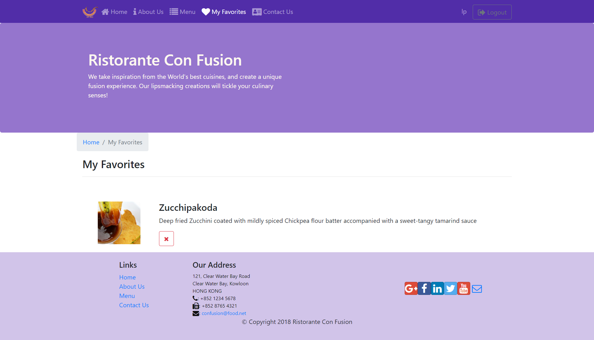
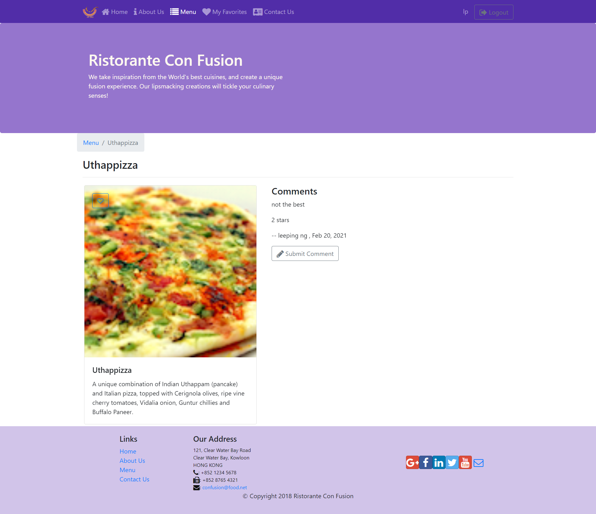

# Full Stack Web Development with React

This repo contains a runnable demo of a complete website with both front-end and back-end, from a [Coursera specialization](https://www.coursera.org/learn/front-end-react) that I took from late 2020 to early 2021. The back-end was built from lesson instructions and during homework assignments, while the front-end code was provided by the instructor as a means to test the back-end.


## Background of Javascript-based Web Dev

I wrote this section partly as a segue to the next section on getting started, and partly as a resource to document the interesting evolution of web development over the years.

The application in this repo uses a typical client-server [three-tier architecture](https://en.wikipedia.org/wiki/Multitier_architecture), which clearly separates the responsibilities of each tier and makes the application more flexible and reusable.

| Tier | Traditional Web Dev | Full Stack Javascript Dev |
| - | - | - |
| Presentation | html, css, js | react, vue, etc |
| Business Logic / Application | Ruby/ Python/ Java /C++ / PHP | Node.js with Express |
| Data | DBMS | MongoDB, etc |
| | | |

Javascript was initially meant to run on the browser, at the presentation tier. Node.js brought it from the browser to the desktop, meaning it could be used for other purposes such as server-side development. Thus, this brought about the advent of full-stack Javascript development, where all 3 tiers are based on Javascript. It's much easier to find a developer skilled in Javascript, compared to a developer skilled in multiple languages for the whole stack.

As Javascript is being used beyond it's original intentions, it lacked the traits of typical languages such as the ability to distribute into multiple .js files, and having common libraries to import (e.g. time). This is where CommonJS comes in - it allows each .js file to be a *Node module* that can be imported or exported. That is why we use NPM (Node Package Manager) to install 3rd party node modules.

The Javascript libraries/frameworks used in this repo are as follows:
- Presentation tier: React, which is the front end library built by Facebook
- Business logic / application tier: Express with Node.js. Express is a very popular framework/ node module for building HTTP servers that use [REST api](https://en.wikipedia.org/wiki/Representational_state_transfer)
- Data tier: MongoDB, a NoSQL database that's [easier to scale](https://www.mongodb.com/nosql-explained/nosql-vs-sql) compared to traditional relational SQL databases. Data is stored in [BSON documents](https://www.mongodb.com/json-and-bson), which is similar to JSON but with improvements.


## How to Start

The servers and client will all be run locally from your computer, and you'll be required to start 3 separate terminal windows to run the MongoDB server, Express Node.js server, and React client.

1. Clone this repo:
    ```
    git clone https://github.com/leeping-ng/web-references.git
    cd web-references/full-stack
    ```
2. Download and install [MongoDB](https://www.mongodb.com/3). Then, run these commands:
    ```
    mkdir mongoDB-server
    cd mongoDB-server
    mkdir data
    ```
3. Start the mongoDB server at the `mongoDB-server` directory:
    ```
    mongod --dbpath=data --bind_ip 127.0.0.1
    ```
4. At the moment, the mongoDB database has nothing inside. We'll need to add collections to the database in the following steps,
using [Postman](https://www.postman.com/), which makes it easier than using the CLI of Mongo REPL. Nevertheless, this will be quite a lengthy process.

5. To use Postman, we'll have to get the Express server up and running first. First, we'll need to [install Node](https://nodejs.org/en/).

6. Open a new terminal window, and start the Express server:
    ```
    cd express-server
    npm install # install all dependencies in package.json
    npm start
    ```

7. Create an administrator account:
    - The Express server was designed with 2 categories of accounts: "admin" with special privileges such as adding and deleting collections to the database, and the typical user without these rights.
    - Using Postman, we'll create an admin account. 
    Do a POST request to `http://localhost:3000/users/signup` with the following in the body as JSON:
        ```
        {"username": "admin", "password":"password"}
        ```

        

    - However, this isn't a true admin account yet. That's because for all accounts created on the REST API endpoint, we disallow the user to configure an admin account directly (and rightly so). We'll need to go behind the scenes to set the "admin" flag to *true* in the Mongo REPL. 
    - Open a new terminal and:
        ```
        mongo
        use conFusion # db name set in config.js
        db.users.find().pretty()
        ```
        We can see that the "admin" flag is set to false for this account.
        
    - Run the following commands to set the "admin" flag to *true*.
        ```
        db.users.update({"username": "admin"}, {$set: {"admin": true}})
        db.users.find().pretty()
        ```
        Now you'll find that the admin flag is set to true.

8. Login as an administrator:
    - In Postman, do a POST request to `http://localhost:3000/users/login`, keeping the previous details in the body.
        ```
        {"username": "admin", "password":"password"}
        ```
        Below shows a successful login:
        

    - The highlighted string in the image is the `token`. Copy it, and paste it in the Authorization tab, with the "Bearer Token" option.
    - Do a GET request on `http://localhost:3000/users` and it should show that "admin" is the only registered user.
    This endpoint is only available for those with "admin": true so it's a good check to see if the above steps were done correctly.

9. Start adding collections to the MongoDB database:
    - [db.json](db.json) contains the JSON data required for the database. We will be copying from this file and pasting into Postman, one at a time.
    - Dishes: There are a total of 4 different dishes. Do a  POST request to `http://localhost:3000/dishes` for each dish separately, copying from db.json and pasting the details of each dish in the JSON body field of Postman as shown below.

        
    - Leaders: There are a total of 4 different leaders. Do a  POST request to `http://localhost:3000/leaders` for each leader separately, pasting the details of each leader.
    - Promotions: There is only 1 promotion. Do a single POST request to `http://localhost:3000/promotions`, pasting the details of each promotion.
    - Performing this check on Mongo REPL will yield results for each.
        ```
        db.dishes.find().pretty()
        db.leaders.find().pretty()
        db.promotions.find().pretty()
        ```

10. Create a user account, login, and add a favorite dish:
    - There are 2 reasons for this - firstly, a user is able to perform some tasks like adding to favorites or adding comments to dishes that an admin is not able to. Secondly, there's a bug in the code that crashes the client when clicking on any dish under menu. This can be resolved by creating a user account and adding a favorite to it.
    - Follow the previous instructions to create the account, login, and authenticate, using the account details below in the JSON body field.
    ```
    {
        "firstname": "leeping",
        "lastname": "ng",
        "username": "lp",
        "password": "password"
    }
    ```
    - Perform a GET on `http://localhost:3000/dishes` and copy the dish ID of any dish
    - Do a POST on `http://localhost:3000/favorites/6030f7fc2a8283413c64f54e` by pasting the dish ID here. Now it's been added to favorites.
    - Finally, we have completed setting up the MongoDB database.


11. Open a new terminal window, and start the React client:
    ```
    cd react-client
    yarn install --ignore-engines # install node modules
    yarn start
    ```
    Respond 'Y' to this prompt.
    ```
    Something is already running on port 3000.
    Would you like to run the app on another port instead? (Y/n)
    ```

12. The website should automatically open on your browser. The view below shows the home page. 
    

13. Play around with the functionality as a user:
    - Login as a user by clicking the *login* button at the top right, and signing in with the details used when setting up the user account in the earlier step. If successful, the username should appear beside the *login* button
    - Add a dish as a favorite by clicking the heart. It can be removed from favorites by clicking the 'x' as shown below.
        
    - Click on a dish and add a comment as follows:
        

## Additional Details

Here are some Node modules used by the Express server that are worth a mention:
- Express Router (within Express Node Module): Allows the application to be subdivided and organized into multiple mini Express-like applications, which combine together to form the Express application. This really helps tidy up the code when we are dealing with various REST API and parts.
- Express Generator: Installed as a global Node Module, it is a quick scaffolding tool that will help us to quickly build up the structure for an Express application with some starting code already built and some standard middleware already included into the application.
- Mongoose ODM: MongoDB is a NoSQL database, and doesn't explicitly need structure for it's documents unlike relational databases. In our application we would like some structure, so Mongoose ODM allows us to build a schema to apply structure to our documents.
- Mongoose Population: NoSQL databases are not relational, but sometimes, we want to pull information from a document into another, to avoid duplicating information in both documents. Mongoose Population helps deal with this. However, it does create overheads on the server as it takes time to perform the search, and thus should be used sparingly.
- Passport and JSON Web Token: For token-based authentication. We saw how this worked in the previous section where the token was generated upon login, and had to be pasted into the bearer token field.
    - Cookie and session-based authentication require the server to keep track of different users, which violates the REST principle of stateless servers, and therefore is not scalable. Also, mobile apps have a tough time with these.
    - In token-based authentication, the server issues a token to a validated user. All subsequent requests from the client will have the token in the request header/body, and nothing is stored on the server. Also, this method helps with CORS or CSRF problems.
- https: http plus the use of encryption and decryption, supported through SSL and TLS. The private key and public certificate are stored in [bin](bin), and traffic is redirected from the insecure HTTP server to the secure HTTPS server.
- Multer: to allow file uploads.
- CORS (Cross Origin Resource Sharing): Most browsers implement a security mechanism called the [same-origin policy](https://developer.mozilla.org/en-US/docs/Web/Security/Same-origin_policy) that restricts how a document or a script loaded from one origin will interact with resources from another origin. The origin is different if the protocol (http/https), port, and host are different. In our case, because we implemented the https server, the protocol is different and therefore we need to use CORS.


